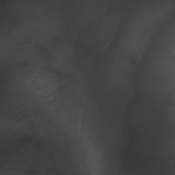
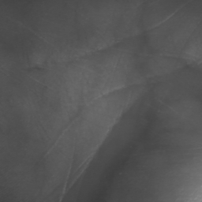

# Palmvein Recognition using Tensorflow
>This is a Tensorflow implementation of the palmvein recognizer. The project also uses ideas from the paper ["FaceNet: A Unified Embedding for Face Recognition and Clustering"](https://arxiv.org/abs/1503.03832).

## Environment
The code is tested using Tensorflow r1.6 under Windows10 with Python 3.5.

## Inspiration

The code is heavily inspired by the ["FaceNet"](https://github.com/davidsandberg/facenet) implementation.

## Contactless Palmvein Image Dataset

The ["Tongji Contactless Palmvein Dataset"](http://sse.tongji.edu.cn/linzhang/contactlesspalmvein/index.htm) has been used for train and test. The dataset consists of total of 12000 images over 600 identities after palmvein detection.

### ROI
The ["ROI image"](https://drive.google.com/open?id=1P_AfQNAK36rDzZnBjgxnIAfRMLxYiTg8) has been used for experiment.  

&nbsp;&nbsp;&nbsp;&nbsp;
&nbsp;&nbsp;&nbsp;&nbsp;

## Feature Extractor Training
We choose the first 360 classes in the palmvein ROI dataset for training. This training set consists of total of 7200 images over 360 identities.It is assumed that the training dataset is arranged as below, i.e. where each class is a directory containing the training examples belonging to that class. The 'F' represents the first session of constactless palmvein ROI dataset, and the 'S' represents the second session of dataset. The class name '0xxx1' represents (xxx+1)th types of data.
>00001  
>&nbsp;&nbsp;&nbsp;&nbsp;&nbsp;&nbsp;F_a_00001.bmp  
>&nbsp;&nbsp;&nbsp;&nbsp;&nbsp;&nbsp;......  
>&nbsp;&nbsp;&nbsp;&nbsp;&nbsp;&nbsp;F_a_00010.bmp  
>&nbsp;&nbsp;&nbsp;&nbsp;&nbsp;&nbsp;S_a_00001.bmp  
>&nbsp;&nbsp;&nbsp;&nbsp;&nbsp;&nbsp;......  
>&nbsp;&nbsp;&nbsp;&nbsp;&nbsp;&nbsp;S_a_00010.bmp  
>00011  
>&nbsp;&nbsp;&nbsp;&nbsp;&nbsp;&nbsp;F_a_00011.bmp  
>&nbsp;&nbsp;&nbsp;&nbsp;&nbsp;&nbsp;......  
>&nbsp;&nbsp;&nbsp;&nbsp;&nbsp;&nbsp;F_a_00020.bmp  
>&nbsp;&nbsp;&nbsp;&nbsp;&nbsp;&nbsp;S_a_00011.bmp  
>&nbsp;&nbsp;&nbsp;&nbsp;&nbsp;&nbsp;......  
>&nbsp;&nbsp;&nbsp;&nbsp;&nbsp;&nbsp;S_a_00020.bmp  
>.  
>.  
>.  
>03591  
>&nbsp;&nbsp;&nbsp;&nbsp;&nbsp;&nbsp;F_a_03591.bmp  
>&nbsp;&nbsp;&nbsp;&nbsp;&nbsp;&nbsp;......  
>&nbsp;&nbsp;&nbsp;&nbsp;&nbsp;&nbsp;F_a_00010.bmp  
>&nbsp;&nbsp;&nbsp;&nbsp;&nbsp;&nbsp;S_a_00001.bmp  
>&nbsp;&nbsp;&nbsp;&nbsp;&nbsp;&nbsp;......  
>&nbsp;&nbsp;&nbsp;&nbsp;&nbsp;&nbsp;S_a_03600.bmp  

Training is started by running code/palmvein_train.py
>python code/palmvein_train.py
## Palmvein identification
### SVM classifier training
It is assumed that the SVM classifier training dataset is arranged as below, i.e. where each class is a directory containing the training examples belonging to that class. The 'F' represents the first session of constactless palmvein ROI dataset, and the 'S' represents the second session of dataset. The class name '0xxx1' represents (xxx+1)th types of data.
>03601  
>&nbsp;&nbsp;&nbsp;&nbsp;&nbsp;&nbsp;F_a_03601.bmp  
>&nbsp;&nbsp;&nbsp;&nbsp;&nbsp;&nbsp;......  
>&nbsp;&nbsp;&nbsp;&nbsp;&nbsp;&nbsp;F_a_03605.bmp  
>&nbsp;&nbsp;&nbsp;&nbsp;&nbsp;&nbsp;S_a_03601.bmp  
>&nbsp;&nbsp;&nbsp;&nbsp;&nbsp;&nbsp;......  
>&nbsp;&nbsp;&nbsp;&nbsp;&nbsp;&nbsp;S_a_03605.bmp  
>03611  
>&nbsp;&nbsp;&nbsp;&nbsp;&nbsp;&nbsp;F_a_03611.bmp  
>&nbsp;&nbsp;&nbsp;&nbsp;&nbsp;&nbsp;......  
>&nbsp;&nbsp;&nbsp;&nbsp;&nbsp;&nbsp;F_a_03615.bmp  
>&nbsp;&nbsp;&nbsp;&nbsp;&nbsp;&nbsp;S_a_03611.bmp  
>&nbsp;&nbsp;&nbsp;&nbsp;&nbsp;&nbsp;......  
>&nbsp;&nbsp;&nbsp;&nbsp;&nbsp;&nbsp;S_a_03615.bmp  
>.  
>.  
>.  
>05991  
>&nbsp;&nbsp;&nbsp;&nbsp;&nbsp;&nbsp;F_a_05991.bmp  
>&nbsp;&nbsp;&nbsp;&nbsp;&nbsp;&nbsp;......  
>&nbsp;&nbsp;&nbsp;&nbsp;&nbsp;&nbsp;F_a_05995.bmp  
>&nbsp;&nbsp;&nbsp;&nbsp;&nbsp;&nbsp;S_a_05991.bmp  
>&nbsp;&nbsp;&nbsp;&nbsp;&nbsp;&nbsp;......  
>&nbsp;&nbsp;&nbsp;&nbsp;&nbsp;&nbsp;S_a_05995.bmp  
SVM classifier training is started by running code/classifier.py.
>python code/classifier.py  --mode TRAIN
### Identification Experiment
Identification experiment is started by running code/classifier.py.
>python code/classifier.py  --mode CLASSIFY
## Palmvein verification
### Genuine Matching and Impostor Matching
For genuine matching, the two palmvein images belong to the same palm and come from different sessions. For impostor matching, the two palmprint images belong to different palms
and come from different sessions.
### Verification Experiment
Like identification experiment, calculate the Euclidean distance of two feature vectors.
